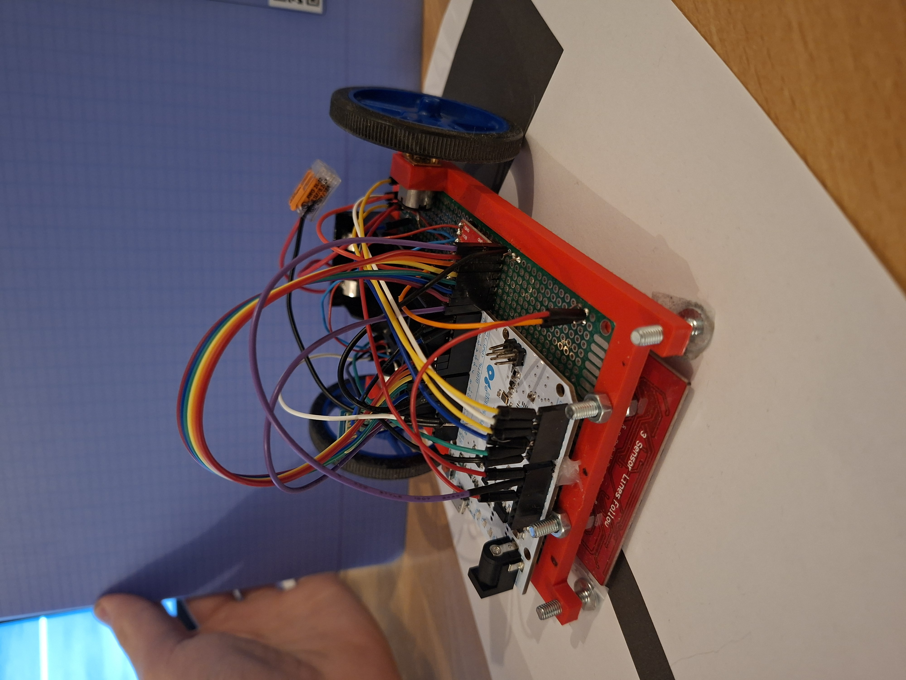

# LineFollower

  
## specifications

microcontroller: Arduino Leonardo	atmega32u4

motors: Aslong DC-Transmissiemotor JGA12-N20-30 - 6V - 500RPM

h-bridge:	TB6612FNG

sensors: HY-S301

batteries: 	EVE ICR18650-26VA 2650mAh - 13A

wireless communication: HC-05 Wireless Module	RN-42

distance sensor - motors: 11cm

weight: 244g

speed: 0,74499 m/s

